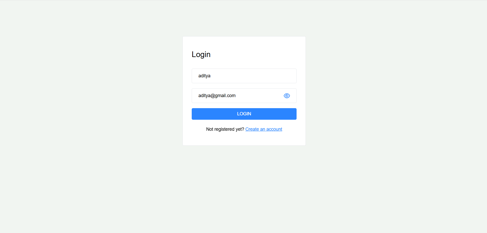
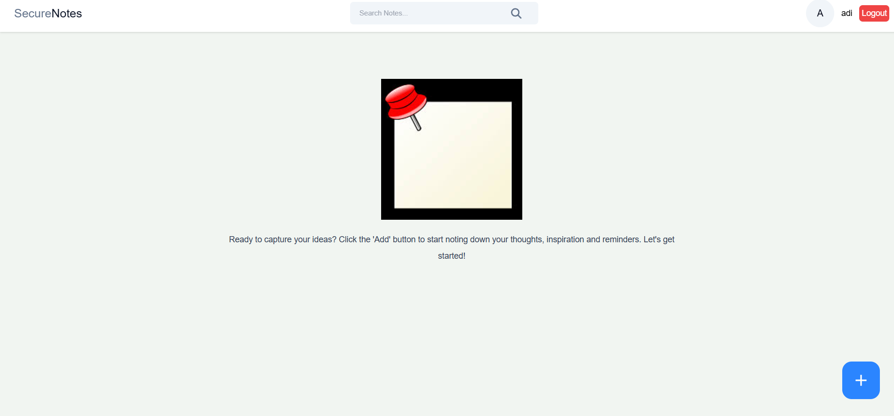
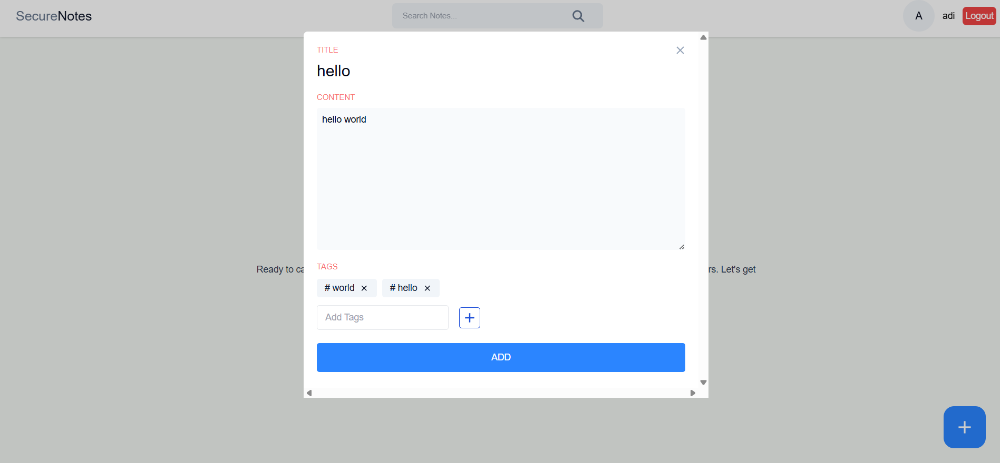
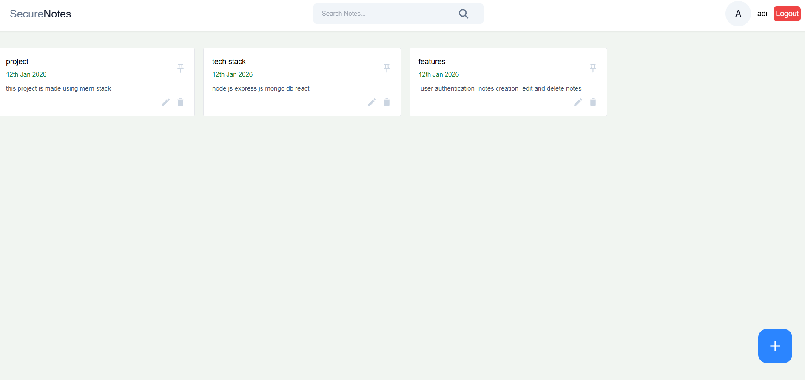

## Steps to Run the Project
Install backend dependencies
-cd backend
-npm install
-write your Mongo URI and JWT_SECRET key in .env file in backend
-nodemon run dev

Install frontend dependencies
-cd ../frontend
-npm install
-npm run dev

## key features of the Project
-Authentication : Implement user login and sign up functionality to securely manage access to your note
-CRUD operations: Add , updates and delete notes with ease
-Pin important notes : Highlight and pin important notes to the top for quick access 
-search functionality : search through your to find what exactly you are looking for quickly
-tag feature : add specific tags to each notes so that searching becomes efficient and faster

## Tech Stack
- **Frontend:** React.js, JavaScript, CSS
- **Backend:** Node.js, Express.js
- **Database:** MongoDB
- **Authentication:** JWT (JSON Web Token)
- **API Architecture:** RESTful APIs

## Screenshots

  
  
  
  

